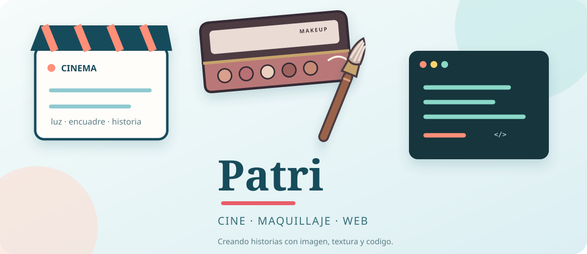

<div align="center">

# Patricia Escudero

### 🎬 Cine · 💄 Maquillaje · 💻 Desarrollo web



Creo, aprendo y experimento mezclando la mirada cinematográfica, el maquillaje de caracterización y la tecnología.


</div>

---

## Sobre mí

Soy una desarrolladora web en formación con interés por los proyectos visuales y creativos. Me gusta transformar ideas en experiencias que tengan intención, personalidad y una buena historia detrás.

|          🎬 Cine          |       💄 Maquillaje        |       💻 Web        |
| :-----------------------: | :------------------------: | :-----------------: |
| Luz, encuadre y narrativa | Caracterización y texturas | Interfaces y código |

## Lo que estoy aprendiendo

```text
Python        ███████░░░  En progreso
HTML / CSS    ███████░░░  En progreso
Diseño UI     ██████░░░░  Explorando
Git / GitHub  ██████░░░░  Practicando
```

## Proyectos

### 🎨 Exploración de identidad visual

Diseños SVG y propuestas visuales para presentar mi perfil creativo y profesional.

### 🧪 Primeros proyectos web

Prácticas con HTML, CSS y Python mientras construyo una base sólida como desarrolladora.

> Este perfil está creciendo al mismo ritmo que mis proyectos: paso a paso, con curiosidad y muchas ganas de crear.

## Herramientas


## Contacto

¿Tienes una idea creativa o un proyecto interesante? Puedes encontrarme en [GitHub](https://github.com/) y seguir por aquí mi evolución.

<div align="center">

### Gracias por visitar mi perfil ✨

</div>

